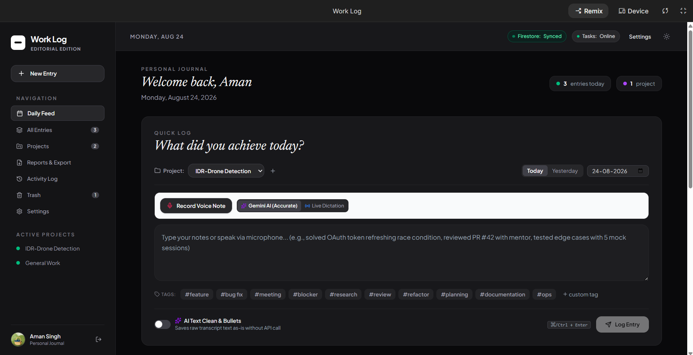
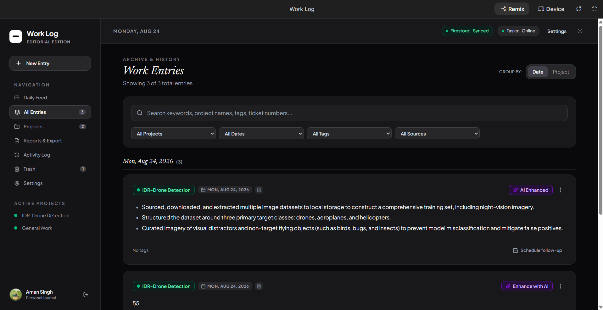
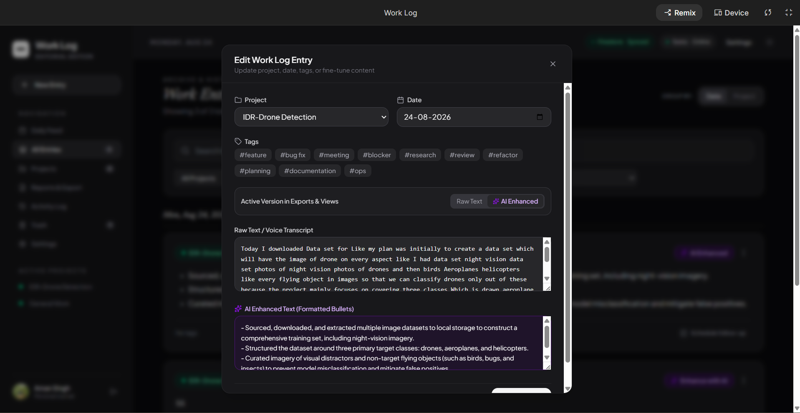
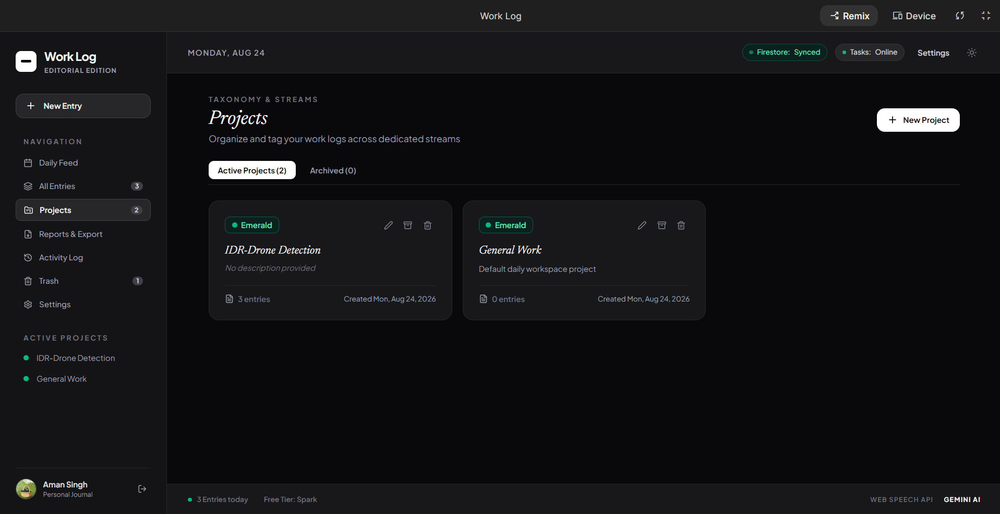
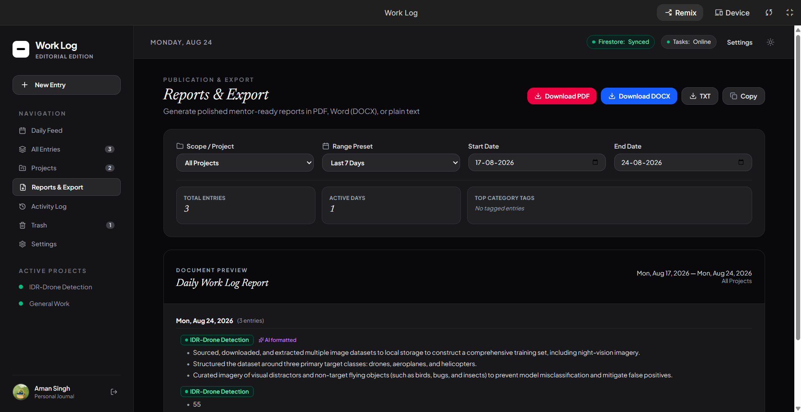
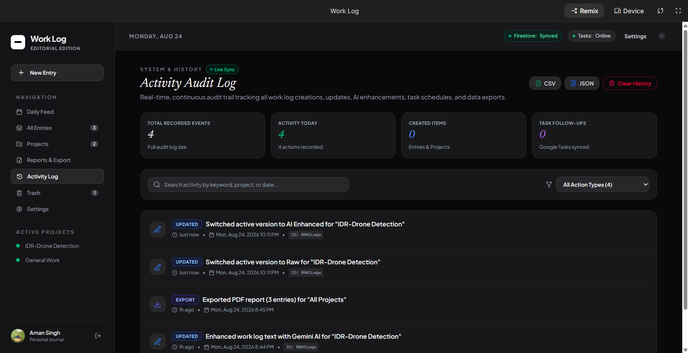
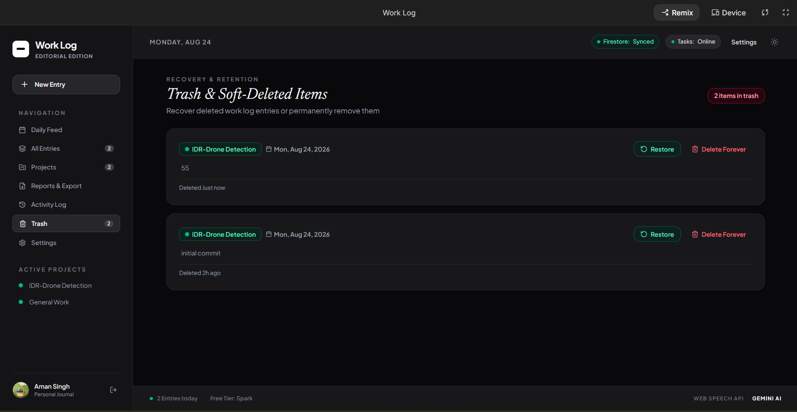
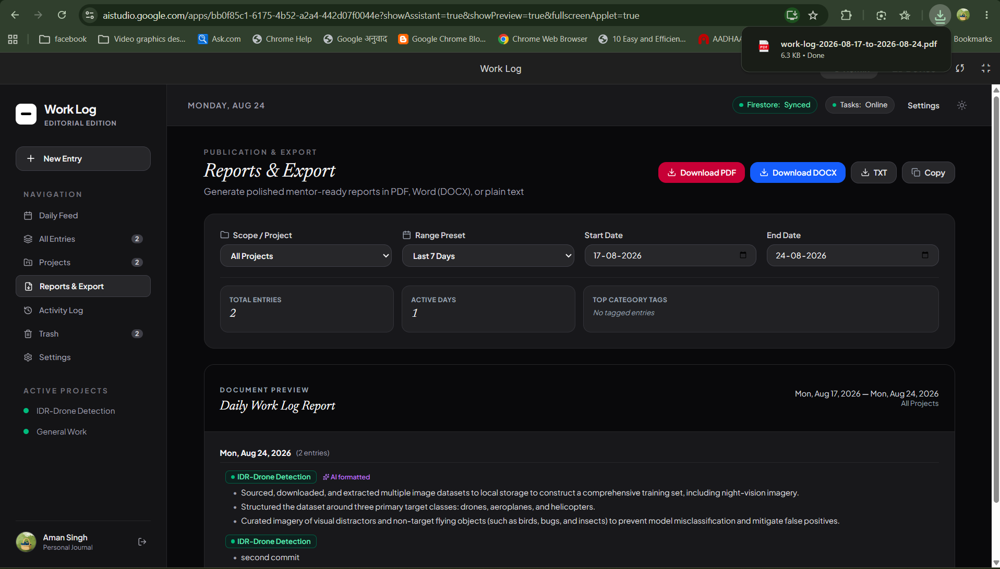
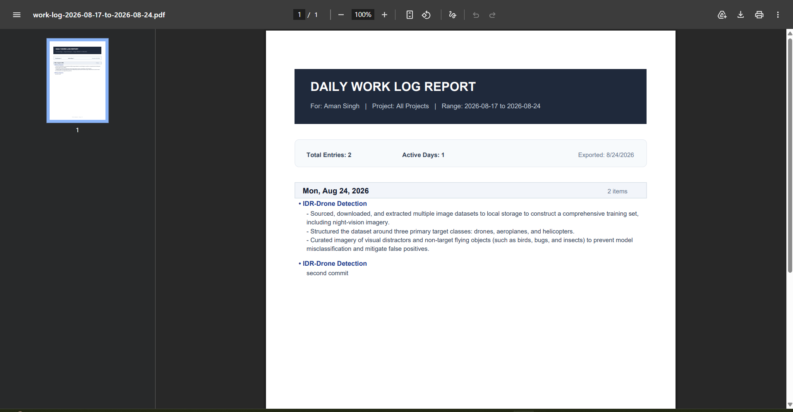

# WorkLog — Personal Work Journal & Daily Standup Assistant

A privacy-focused, full-stack progressive web application designed for software engineers, product managers, and knowledge workers to effortlessly log daily achievements, structure messy thoughts into polished executive bullets, sync follow-up tasks, and generate client-ready reports.

---

## 📸 Visual UI Tour & Feature Walkthrough

Explore the complete user experience of **WorkLog**, from rapid multi-modal logging to automated document export.

---

### 1. 📅 Daily Feed & Quick Work Logger
*The central workspace view providing a distraction-free daily log interface with real-time Firestore synchronization.*  
*Supports high-speed keyboard capture, custom project streams, live browser speech dictation, and Gemini AI voice-note transcription.*



---

### 2. 🗂️ All Entries & Historical Archive
*A chronological, searchable archive aggregating all historical work logs grouped flexibly by Date or Project.*  
*Features multi-criteria filtering across project streams, date ranges, custom tags, and active AI-enhanced status.*



---

### 3. ✍️ Dual-Version Entry Editor
*A non-destructive modal editor that preserves both your verbatim voice transcripts and AI-cleaned bullet points side-by-side.*  
*Allows fine-tuning tags, updating project assignments, modifying timestamps, and toggling active display versions on the fly.*



---

### 4. 📁 Projects & Taxonomy Streams
*Dedicated stream management enabling users to organize and isolate work logs across distinct client or feature streams.*  
*Displays active entry counts, creation timestamps, archive status, and one-click stream customization with color badges.*



---

### 5. 📊 Reports & Export Center
*An interactive reporting dashboard to synthesize accomplishments across custom date ranges and project scopes.*  
*Provides dynamic rollup metrics (total entries, active days, top tags) with instant one-click export to PDF, Word (DOCX), and Plain Text.*



---

### 6. 🕒 Activity Audit Log & System History
*A real-time, tamper-evident audit trail capturing every system event including log creation, edits, version switches, and data exports.*  
*Equipped with quick summary metrics, action-type filters, and instant CSV / JSON export for compliance and backups.*



---

### 7. 🗑️ Trash Bin & Soft-Delete Recovery
*A fail-safe retention space that prevents accidental data loss with dedicated two-step soft-deletion.*  
*Allows instant one-click restoration of accidentally deleted work logs or permanent removal when needed.*



---

### 8. ⚡ Instant Export & Download Notification
*Seamless client-side report compilation generating structured, standalone document artifacts instantly.*  
*Features automated date-range naming conventions and direct browser download notifications.*



---

### 9. 📄 Exported Daily Work Log PDF Document
*Executive-ready, clean PDF formatting tailored for stakeholder reviews, manager 1-on-1s, and client billing.*  
*Includes high-contrast branding headers, summary metrics, date-stratified task grouping, and impact-driven bullet points.*



---

## ✨ Features

- **🎙️ Multi-Modal Input**
  - **Quick Text Input**: Fast keyboard-first logging with auto-tagging (`#feature`, `#bugfix`, `#meeting`, etc.) and `Cmd/Ctrl + Enter` instant capture.
  - **Live Web Speech Dictation**: Continuous, zero-latency browser-native speech-to-text.
  - **AI Audio Transcription**: High-accuracy audio recording powered by Gemini AI with automatic recognition of developer jargon, acronyms, and technical terms.

- **⚡ Gemini AI Text Enhancement**
  - Converts informal stream-of-consciousness logs into concise, impact-oriented bullet points.
  - Automatic model failover and exponential retry mechanisms to guarantee uninterrupted availability.
  - Non-destructive Dual-Version toggle: switch between raw transcripts and AI-cleaned versions at any time.

- **📅 Task Scheduling & Google Tasks Integration**
  - Extract action items directly from work logs.
  - Schedule follow-up items with custom due dates and link directly to Google Tasks.

- **📊 Comprehensive Reports & Export Engine**
  - Summarize work across custom date ranges (Today, This Week, This Month, or custom periods).
  - Export professional summaries to **PDF**, **Microsoft Word (.docx)**, **Markdown (.md)**, and **JSON backups**.

- **🕒 Real-time Audit Trail & Activity Log**
  - Complete history of all actions: entry creation, edits, AI version switches, deletions, restorations, and project updates.
  - Soft-delete with a dedicated Trash Bin and one-click item restoration.

- **📁 Project & Category Management**
  - Organize work logs by project with custom color tags.
  - Filter daily feeds by project, date, keyword, or tag.

- **🎨 Modern Responsive UI**
  - Dark and Light mode support with adaptive system themes.
  - Fluid animations powered by Motion.
  - Mobile and desktop responsive layouts.

---

## 🛠️ Technology Stack & Architecture

```text
┌─────────────────────────────────────────────────────────────┐
│                       Vercel Platform                       │
│  ┌─────────────────────────┐   ┌──────────────────────────┐ │
│  │   Vite + React SPA      │   │  Serverless Functions    │ │
│  │   (Static Frontend)     │   │  (/api/enhance,          │ │
│  │                         │   │   /api/transcribe-audio) │ │
│  └───────────┬─────────────┘   └────────────┬─────────────┘ │
└──────────────┼──────────────────────────────┼───────────────┘
               │ (Client Auth & Data Sync)    │ (Secure Gemini AI Calls)
               ▼                              ▼
┌────────────────────────────┐   ┌────────────────────────────┐
│   Firebase Console Cloud   │   │     Google Gemini AI       │
│   • Firestore Database     │   │     • Text Enhancement     │
│   • Firebase Authentication│   │     • Audio Transcription  │
│   • Security Rules         │   │                            │
└────────────────────────────┘   └────────────────────────────┘
```

| Layer | Technology |
|---|---|
| **Hosting & API** | **Vercel** (Frontend static build + Serverless Node.js API routes) |
| **Frontend** | React 19, TypeScript, Tailwind CSS v4, Motion, Lucide React |
| **Database & Auth** | **Firebase Console** (Firestore + Google Authentication) |
| **AI Intelligence** | `@google/genai` (Gemini Flash with multi-model failover) |
| **Document Export** | `jspdf`, `jspdf-autotable`, `docx`, `file-saver` |

---

## 🌐 Deploying to Vercel + Firebase Console

Deploying the entire project using your own **Firebase Console** and **Vercel** takes under 5 minutes.

### Step 1: Set Up Your Firebase Project
1. Go to the [Firebase Console](https://console.firebase.google.com/) and click **Add Project**.
2. **Enable Firestore**:
   - Go to **Build > Firestore Database** and click **Create Database** (choose production or test mode).
   - In the **Rules** tab, paste the content from `firestore.rules` and click **Publish**.
3. **Enable Authentication**:
   - Go to **Build > Authentication > Sign-in method**.
   - Enable **Google** provider and **Anonymous** (Guest) provider.
4. **Get Your Web App Credentials**:
   - Go to **Project Settings** (gear icon) > **General** > **Your Apps** > Click the **</>** (Web) icon.
   - Register the app and copy the `firebaseConfig` keys.

---

### Step 2: Deploy to Vercel
1. Push this repository to your **GitHub** account.
2. Log in to [Vercel](https://vercel.com/) and click **Add New > Project**.
3. Import your GitHub repository.
4. In the **Environment Variables** section, add the following keys:

| Environment Variable | Value / Description |
|---|---|
| `GEMINI_API_KEY` | Your [Gemini API Key](https://aistudio.google.com/app/apikey) |
| `VITE_FIREBASE_API_KEY` | Your Firebase `apiKey` |
| `VITE_FIREBASE_AUTH_DOMAIN` | Your Firebase `authDomain` |
| `VITE_FIREBASE_PROJECT_ID` | Your Firebase `projectId` |
| `VITE_FIREBASE_STORAGE_BUCKET` | Your Firebase `storageBucket` |
| `VITE_FIREBASE_MESSAGING_SENDER_ID` | Your Firebase `messagingSenderId` |
| `VITE_FIREBASE_APP_ID` | Your Firebase `appId` |
| `VITE_FIREBASE_MEASUREMENT_ID` | Optional measurement ID |

5. Click **Deploy**. Vercel will automatically build the React Vite frontend and configure the `/api/` serverless functions.

---

### Step 3: Authorize Your Vercel Domain in Firebase
1. After Vercel gives you your production URL (e.g. `https://your-worklog.vercel.app`), go to **Firebase Console > Authentication > Settings > Authorized Domains**.
2. Click **Add Domain** and enter your Vercel domain (`your-worklog.vercel.app`).

---

## 💻 Local Development Setup

### 1. Installation

```bash
git clone https://github.com/your-username/work-log.git
cd work-log
npm install
```

### 2. Configure Environment

Copy `.env.example` to `.env`:

```bash
cp .env.example .env
```

Add your `GEMINI_API_KEY` and Firebase credentials to `.env`.

### 3. Run Dev Server

```bash
npm run dev
```

The app will be accessible at `http://localhost:3000`.

---

## 📂 Project Structure

```text
├── api/                  # Vercel Serverless Functions (/api/enhance, /api/transcribe-audio)
├── docs/                 # Project documentation & UI screenshots
│   └── screenshots/      # High-resolution feature walkthrough captures
├── src/
│   ├── components/       # UI components (NewEntryForm, EntryCard, Modals, Navbar, etc.)
│   ├── context/          # State management (AuthContext, WorkLogContext)
│   ├── lib/              # Firebase client configuration & persistence
│   ├── services/         # Client-side API services
│   ├── views/            # Main views (DailyFeed, AllEntries, Projects, Reports, ActivityLog, Trash, Settings)
│   ├── types.ts          # TypeScript interfaces & models
│   ├── App.tsx           # Router and navigation shell
│   └── main.tsx          # React application entry point
├── server.ts             # Local Express server with Vite integration
├── vercel.json           # Vercel deployment and routing configuration
├── firestore.rules       # Security rules for Firebase Firestore
├── .env.example          # Sample environment variables
└── vite.config.ts        # Vite build configuration
```

---

## 🔒 Privacy & Data Security

- **Server-Side API Proxying**: API keys are securely kept in backend serverless functions and never exposed to the client.
- **Direct Database Scoping**: User documents in Firestore are protected by Firestore Security Rules.
- **Export Control**: Export your complete database anytime as JSON, PDF, or Word DOCX.

---

## 📄 License

This project is open-source and available under the [MIT License](LICENSE).
